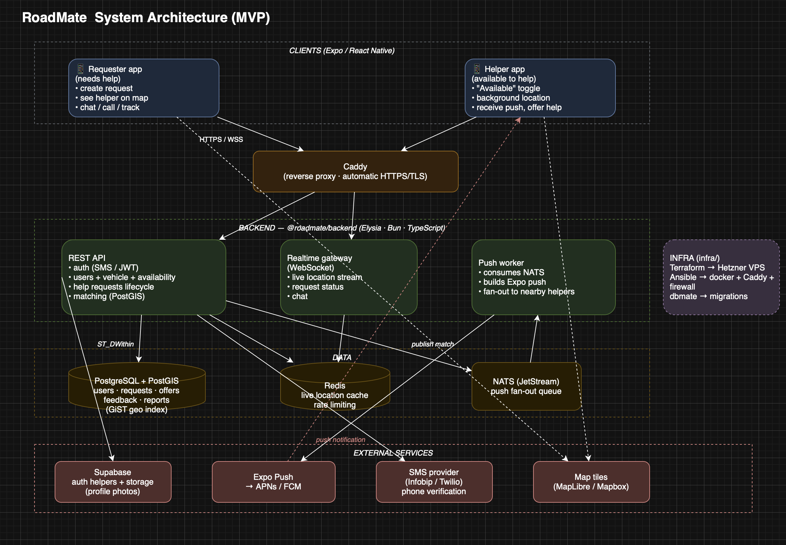

## Architecture



## Layout

| Path | What | Status |
|------|------|--------|
| `packages/web`     | **MVP frontend** — Vite + React + Tailwind + MapLibre, talks directly to Supabase | active |
| `packages/shared`  | Shared TypeScript types & zod contracts (reused by web + future native) | active |
| `packages/backend` | Elysia (Bun) API — for later when we outgrow Supabase (workers, NATS) | parked |
| `packages/mobile`  | Expo (React Native) app — for the eventual native version | parked |
| `docker/`          | Local infra for the parked backend (Postgres+PostGIS, Redis, NATS) | later |
| `infra/`           | IaC — Terraform (Hetzner) + Ansible — for self-hosting the backend | later |

> **MVP architecture:** the web app talks **directly to Supabase** (auth,
> Postgres+PostGIS, realtime, storage). There is no custom backend to run for
> the MVP — `packages/backend`, `docker/` and `infra/` are scaffolded for later.

## Local development

### Prerequisites

- [Bun](https://bun.sh) ≥ 1.3
- [Docker](https://www.docker.com) (for the local Supabase stack)
- [Supabase CLI](https://supabase.com/docs/guides/cli) (installed as a dev dep)

> Everything runs against a **local Supabase** on your machine. You never need
> the cloud project to develop. Production migrations are applied by CI only
> (see *Database migrations* below).

### Run it locally

```bash
# 1. Install all workspace dependencies
bun install

# 2. Start the local Supabase stack (Postgres+PostGIS, Auth, Studio, ...)
bun run db:start         # prints local API URL + keys
#    Local Studio:  http://127.0.0.1:54423

# 3. Apply the migrations to the local DB
bun run db:migrate       # dbmate up (against local Supabase only)

# 4. Point the web app at the LOCAL Supabase
cp packages/web/.env.example packages/web/.env
#    fill VITE_SUPABASE_URL / VITE_SUPABASE_ANON_KEY from the db:start output

# 5. Start the web dev server
bun run dev:web          # http://localhost:5173

bun run db:stop          # stop the local stack when done
```

> Ports are shifted to the 544xx range (see `supabase/config.toml`) so this can
> run alongside another local Supabase project.

### Database migrations

Migrations are **dbmate** files (reversible `-- migrate:up` / `-- migrate:down`)
in `packages/backend/migrations`, applied **only against the local Supabase**:

```bash
bun run db:new <name>    # scaffold a new migration (up/down skeleton)
# ...edit the SQL...
bun run db:migrate       # dbmate up   (apply to local)
bun run db:rollback      # dbmate down (revert last, to test reversibility)
bun run db:status        # show applied / pending
```

**Migrations + web reach a remote env ONLY via CI.** A laptop never writes to
staging or prod. The flow:

1. Add a migration locally; verify with `db:migrate` and `db:rollback`.
2. Open a PR → CI (`db-validate`) applies it up→down→up on a throwaway Supabase.
3. Push/merge to **`staging`** → CI **`deploy`** runs DB migration + Netlify build (staging).
4. Merge to **`main`** → CI **`deploy`** runs DB migration + Netlify build (production).
5. Or run **`deploy`** manually (Actions tab → Run workflow → pick environment).

The single **`deploy`** workflow handles one environment per run: it applies the
DB migration and triggers the matching Netlify build.

Required GitHub Actions **secrets**, split across two environments
(Repo → Settings → Environments):

**`production`** environment:

| Secret | Value |
|--------|-------|
| `SUPABASE_PRODUCTION_PROJECT_REF` | the prod project ref (e.g. `ffqkwegpdtriypbumfss`) |
| `SUPABASE_PRODUCTION_DB_PASSWORD` | the prod database password |
| `NETLIFY_PRODUCTION_BUILD_HOOK` | Netlify build hook URL that builds `main` |
| `PRODUCTION_WEB_URL` | optional production frontend URL for deploy smoke checks |
| `PRODUCTION_API_HEALTH_URL` | optional production backend `/health` URL for deploy smoke checks |
| `DISCORD_PRODUCTION_DEPLOY_WEBHOOK` | optional Discord webhook for production deploy notifications |

**`staging`** environment:

| Secret | Value |
|--------|-------|
| `SUPABASE_STAGING_DB_URL` | full session-pooler connection string (staging Connect → Session pooler) |
| `NETLIFY_STAGING_BUILD_HOOK` | Netlify build hook URL that builds the `staging` branch |
| `STAGING_WEB_URL` | optional staging frontend URL for deploy smoke checks |
| `STAGING_API_HEALTH_URL` | optional staging backend `/health` URL for deploy smoke checks |
| `DISCORD_STAGING_DEPLOY_WEBHOOK` | optional Discord webhook for staging deploy notifications |

> Build hooks: Netlify → Site config → Build & deploy → **Build hooks** → create
> one per environment (set the branch it builds), copy the URL into the secret.
> Disable Netlify's automatic git deploys if you want CI to be the only trigger.
>
> Netlify env vars (public `VITE_SUPABASE_*` keys) stay in the Netlify UI, scoped
> by deploy context (Production → prod, Deploy Previews/Branch → staging).

> `db-deploy` builds the production connection string from these two secrets.
> (A `SUPABASE_ACCESS_TOKEN` is no longer required — dbmate connects directly.)

### Quality checks (same as CI)

```bash
bun run lint        # biome
bun run typecheck   # tsc --noEmit across packages
bun run test        # unit and feature tests
bun run build       # production builds
cd packages/web && bun run test:e2e  # Playwright smoke tests
bun run test        # bun test
```

### Building / preview

```bash
cd packages/web
bun run build        # production build -> dist/
bun run preview      # serve the production build locally
```


## Principles

- **Free.** Helping is voluntary; any compensation is arranged off-app.
- **Single-player useful first.** Seed helpers before requesters.
- **Privacy.** Approximate location shared on request; exact only after a match.
- **Web-first MVP.** Ship a PWA fast to validate the loop with the community;
  go native (push + background location) once it's proven. Keep all non-UI logic
  in `packages/shared` so the native port reuses the brains, not the screens.
